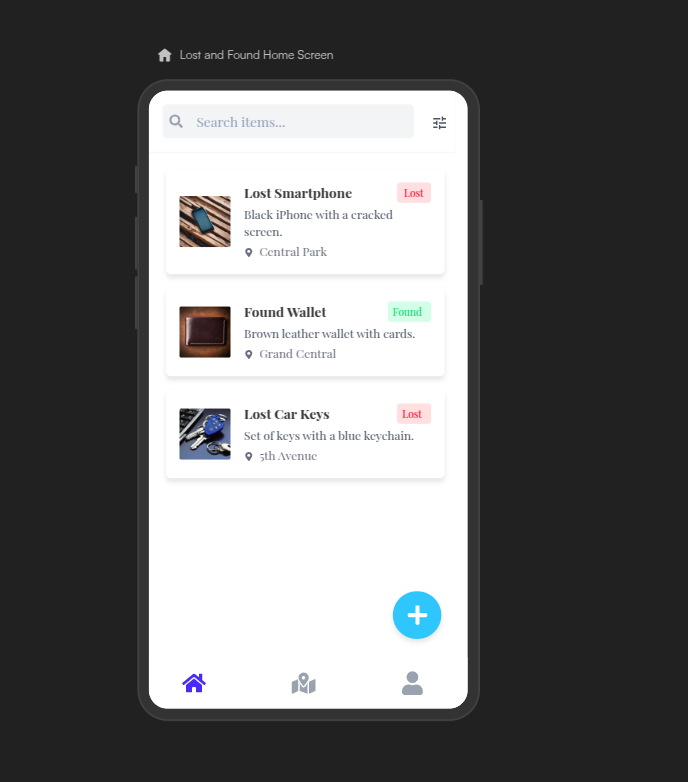

# Task 2: Implement the First UI in view/MainScreen

## Code Explanation

The codebase is structured around the Loukatah application using **MVVM Architecture**. Here are the key components:

1. **ItemViewModel**: Handles the business logic related to items.
2. **MainActivity**: Acts as the entry point of the application.
3. **MainScreen**: Composable that displays the UI, including the list of items.
4. **ItemRepository**: Acts as a repository for items.
5. **ItemCategoryRepository**: Manages item category data.
6. **Item Model & Category Model**: Define the data structure for items and categories.

## Task

Your task is to implement the first UI in `view/MainScreen` based on the design provided in `FirstUI.jpg`. The UI should include:

- A list of items.
- A navigation bar to switch between categories.
- An item detail view when an item is selected.
- A search bar to filter items by name or category.

### Additional Requirements

1. **Add More Items and Categories**:
   - Add at least 5 more items and 2 more item categories to the mock data in `ItemRepository.kt` and `ItemCategoryRepository.kt`.
   - Ensure the new items and categories are displayed in the UI.

2. **Implement Search Functionality**:
   - Add a search bar to the top of the `view/MainScreen` UI.
   - Implement functionality to filter the items list based on the search query (e.g., by item name or category).

## Instructions

1. Open `view/MainScreen.kt`.
2. Implement the UI layout in `view/MainScreen`.
3. Use the `ItemViewModel` to fetch and display items.
4. Ensure the UI matches the design in `FirstUI.jpg`.

## FirstUI

Good luck!
